# YaraHunter

Deepfence YaraHunter scans container images, running Docker containers, and filesystems to find indicators of malware. It uses a [YARA ruleset](https://github.com/deepfence/yara-rules) to identify resources that match known malware signatures, and may indicate that the container or filesystem has been compromised.


Key capabilities:

 * Scan running and at-rest containers; scan filesystems; scan during CI/CD build operations
 * Run anywhere: highly-portable, docker container form factor
 * Designed for automation: easy-to-deploy, easy-to-parse JSON output


## YaraHunter in Action



## Generate License Key

Run this command to generate a license key. Work/official email id has to be used.
```shell
curl https://license.deepfence.io/threatmapper/generate-license?first_name=<FIRST_NAME>&last_name=<LAST_NAME>&email=<EMAIL>&company=<ORGANIZATION_NAME>&resend_email=true
```

## Example: Finding Indicators of Compromise in a Container Image

Images may be compromised with the installation of a cryptominer such as XMRig.  In the following example, we'll scan a legitimiate cryptominer image that contains the same xmrig software that is often installed through an exploit:

```bash
docker pull metal3d/xmrig

docker run -i --rm --name=deepfence-yarahunter \
     -e DEEPFENCE_PRODUCT=<ThreatMapper or ThreatStryker> \
     -e DEEPFENCE_LICENSE=<ThreatMapper or ThreatStryker license key> \
     -v /var/run/docker.sock:/var/run/docker.sock \
     -v /tmp:/home/deepfence/output \
     quay.io/deepfenceio/deepfence_malware_scanner_ce:2.5.5 \
     --image-name metal3d/xmrig:latest \
     --output=json > xmrig-scan.json
```

This returns, among other things, clear indication of the presence of XMRig.  Note that we store the output (`/tmp/xmrig-scan.json`) for quick and easy manipulation:

```bash
# Extract the IOC array values.  From these, extract the values of the 'Matched Rule Name' key
cat /tmp/xmrig-scan.json | jq '.IOC[] | ."Matched Rule Name"'
```

This returns a list of the IOCs identified in the container we scanned.

Rules can also be cached to use next run by mounting a seperate path and passing `rules-path` argument
```bash
docker run -i --rm --name=deepfence-yarahunter \
     -e DEEPFENCE_PRODUCT=<ThreatMapper or ThreatStryker> \
     -e DEEPFENCE_LICENSE=<ThreatMapper or ThreatStryker license key> \
     -v /var/run/docker.sock:/var/run/docker.sock \
     -v /tmp:/home/deepfence/output \
     -v /tmp/rules:/tmp/rules \
     quay.io/deepfenceio/deepfence_malware_scanner_ce:2.5.5 \
     --image-name metal3d/xmrig:latest \
     --output=json \
     --rules-path=/tmp/rules > xmrig-scan.json
```

## When to use YaraHunter

YaraHunter can be used in the following ways:

 * **At build-and-test**: scan build artifacts in the CI/CD pipeline, reporting on possible indicators of malware
 * **At rest**: scan local container images, for example, before they are deployed, to verify they do not contain malware
 * **At runtime**: scan running docker containers, for example, if you observe unusual network traffic or CPU activity
 * **Against filesystems**: at any time, YaraHunter can scan a local filesystems for indicators of compromise